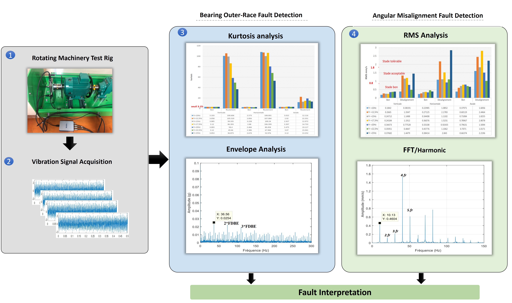
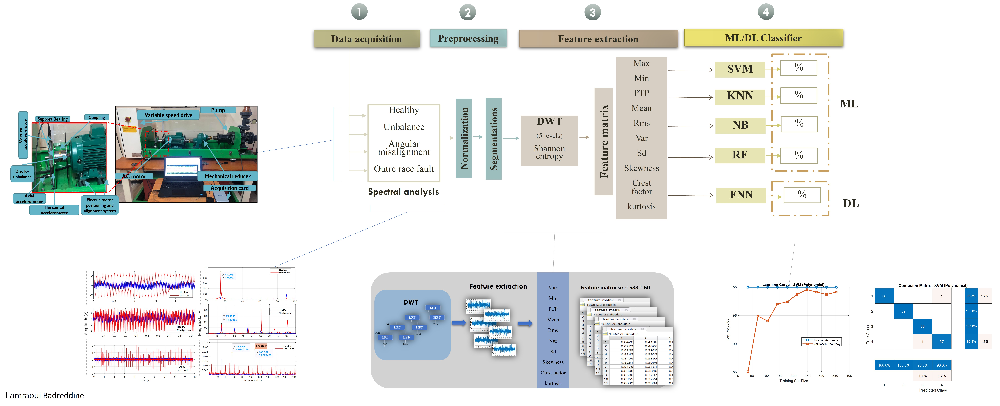

# Lamraoui Badreddine
### **Industrial Maintenance Engineer & PhD Researcher**
📍 Algeria, Oum El Bouaghi | ✉️ lamraoui.badreddine04@gmail.com
🔗 [LinkedIn](https://www.linkedin.com/in/lamraoui-badreddine/) | [GitHub](https://github.com/lambadreddine)

---

##  Professional Summary
Industrial Maintenance Engineer and PhD Researcher with a strong foundation in rotating machinery and industrial systems. Currently finalizing doctoral research in predictive maintenance, specializing in AI-driven fault detection and signal processing. Proven ability to translate complex data models into actionable maintenance strategies that minimize downtime and optimize operational costs. Seeking to leverage advanced diagnostic expertise to improve asset reliability in a high-paced industrial environment.

---

## 🎓 Education

### **Ph.D. in Industrial Maintenance** (Expected 2026)
*Larbi Ben M’hidi University, Oum El Bouaghi, Algeria*
* **Research Focus:** AI-based predictive maintenance, advanced signal processing, and fault detection in rotating equipment.

### **Engineer’s Degree in Industrial Maintenance** (2020–2022)
*University of Science and Technology Houari Boumediene (USTHB), Algeria*
* **Specialization:** Industrial maintenance engineering and reliability.

### **Bachelor’s in Maintenance of Means of Transport** (2017–2020)
*University of the Mantouri Brothers Constantine 1, Algeria*
* **Core Areas:** Mechanical systems, electrical diagnostics, and transport machinery maintenance.

---

## 💼 Professional Experience

### **Teaching Assistant** 
*Larbi Ben M’hidi University, Algeria* | *2024–2025*
* Assisting in courses related to industrial maintenance, reliability, and instrumentation.
* Supervising laboratory sessions and guiding undergraduate students in practical diagnostics.

### **Research Intern** 
*CDIF Laboratory, Universitat Politècnica de Catalunya (UPC), Spain* | *Nov–Dec 2024*
* Conducted high-level analysis of experimental plate crack data using advanced signal processing techniques (FFT, Wavelets) and Machine Learning algorithms.
* Developed automated classification models to identify structural integrity issues, significantly reducing manual effort required for complex industrial diagnostics.
* Collaborated with an international research team on vibration-based structural health monitoring.

### **Maintenance Intern** 
*Technology Hall, USTHB, Algeria* | *May–Jun 2021*
* Diagnosed complex mechanical and electrical defects in Shaper Machines, ensuring 100% operational reliability after repair.
* Documented fault-finding procedures and proposed preventive maintenance measures to avoid recurrence.

---
##  Research Interests
* Predictive Maintenance
* Fault Diagnosis
* Deep Learning
* Signal Processing
* Condition Monitoring

---
## Projects

### Experimental Detection of Misalignment, and Bearing Faults Using Vibration Analysis
**Master's Thesis Project**
Conducted a rigorous condition-monitoring study on a localized machinery test rig to detect, characterize, and isolate low-frequency structural anomalies from high-frequency component defects using multi-axial vibration signatures.
* **Experimental Foundation:** Acquired multi-speed (10 Hz to 25 Hz) tri-axial vibration signals (Vertical, Horizontal, Axial) via a Model 603C01 accelerometer streamed through NI LabVIEW.
* **Structural Fault Mapping:** Isolated **Angular Misalignment** along the **Axial plane**, identifying a dominant $1\times f_r$ harmonic signature in the *displacement* domain and key $3\times f_r$ / $4\times f_r$ harmonic multipliers in the *velocity* domain.
* **Component Fault Mapping:** Diagnosed localized **Bearing Outer-Race Defects** along the **Horizontal Radial plane** using *acceleration* signals, triggering immediate alarms via time-domain **Kurtosis** spikes and isolating specific fault lines ($BPFO$) via **Hilbert Envelope Analysis**.
* **Core Tech Stack:** MATLAB • Signal Processing • Condition-Based Maintenance • Time/Frequency Demodulation

🔗 [👉 Click Here to View Full Source Code & Deep-Dive Analysis](https://github.com/lambadreddine/Experimental-Vibration-Fault-Diagnosis-Using-Statistical-and-Spectral-Analysis)

### 🤖 Intelligent Machinery Fault Diagnosis via DWT & Feedforward Neural Networks

Developed an end-to-end automated artificial intelligence pipeline to identify, isolate, and classify multiple mechanical faults by applying multi-level wavelets and machine learning classifiers on experimental test rig data.

* **The AI Pipeline:** Applied sequence preprocessing (Normalization & Segmentation) followed by a **5-Level Discrete Wavelet Transform (DWT)** to extract time-frequency coefficients.
* **Feature Engineering:** Built a robust **Feature Matrix** by extracting 10 distinct statistical metrics (Kurtosis, RMS, Crest Factor, Skewness, etc.) across all wavelet details ($D_1-D_5$) and approximations ($A_5$).
* **Model Optimization:** Evaluated classical classifiers (SVM, KNN, Naive Bayes, Random Forest) against Deep Learning, where a **Feedforward Neural Network (FNN)** achieved a champion classification accuracy of **99.7%** across 4 classes (Healthy, Unbalance, Misalignment, Outer-Race Fault).
* **Core Tech Stack:** Machine Learning • Feedforward Neural Networks (FNN) • MATLAB  • Wavelet Decomposition (DWT) • Feature Extraction

🔗 [👉 Click Here to View Full Source Code & Machine Learning Architecture](https://github.com/lambadreddine/DWT_ML_Project)

---

## Publications

### Conference Papers
[
- Conference on Mechanical Sciences (2025)
- Conference on Environmental Sciences and Sustainability (CESS’25) (2025)
  
## 🛠️ Key Skills

| Category | Skills & Competencies |
| :--- | :--- |
| **Predictive Maintenance** | Vibration analysis, thermography, oil analysis, condition monitoring. |
| **Signal Processing** | FFT, Wavelet Transform, feature extraction, denoising techniques. |
| **Machine Learning & AI** | Python (Scikit-learn, TensorFlow), classification, anomaly detection. |
| **Software & Engineering Tools** | MATLAB & Simulink, LabVIEW (basic), C/C++ (basics), GitHub. |
| **Backend & DevOps** | FastAPI, Docker, Supabase. |
| **Documentation & Research** | LaTeX, Microsoft Office. |
| **Languages** | Arabic (native), English (professional), French (intermediate). |

---

## 📄 Download Full CV
📥 [Download CV.pdf](./files/CV.pdf)
